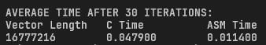
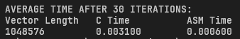
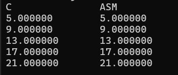

## TODO
## Comparative execution time and short analysis of the performance of the kernels
\
for vector length 2^24

\
for vector length 2^20
### Analysis
As can be seen in the pictures above, the performance of the x86-64 implementation of the kernel is far faster than the C implmentation. This has to do with the lack of overhead cost of compiling the x86-64 implementation as compared to the C implementation.
> **NOTE**: We were not able to test the performance of the kernel given vector length of 2^30. The pictures above show the performance for vector lengths 2^20 and 2^24.
## Screenshot of the program output with the correctness check (C & x86-64).
### Parameters
+ ``vectorLength`` : ``5``
+ ``scalar`` : ``3.0``
+ ``vectorX`` : ``[1.0, 2.0, 3.0, 4.0, 5.0]``
+ ``vectorY`` : ``[2.0, 3.0, 4.0, 5.0, 6.0]``
+ ``vectorZ`` : ``[0, 0, 0, 0, 0]``
### Output (Contained in ``vectorZ``)


## short videos (5-10mins) showing your source code, compilation, and execution of the C and x86-64 program
> **To be done face to face**

## To compile the program
Run the following commands
```
nasm -f win64 mp2a.asm
gcc -c mp2c.c -o mp2c.obj -m64
gcc mp2c.obj mp2a.obj -o mp2.exe -m64
mp2.exe
```

To check the outputs, run these commands
```
nasm -f win64 mp2a.asm
gcc -c sanityCheck.c -o sanityCheck.obj -m64
gcc sanityCheck.obj mp2a.obj -o sanityCheck.exe -m64
sanityCheck.exe
```
